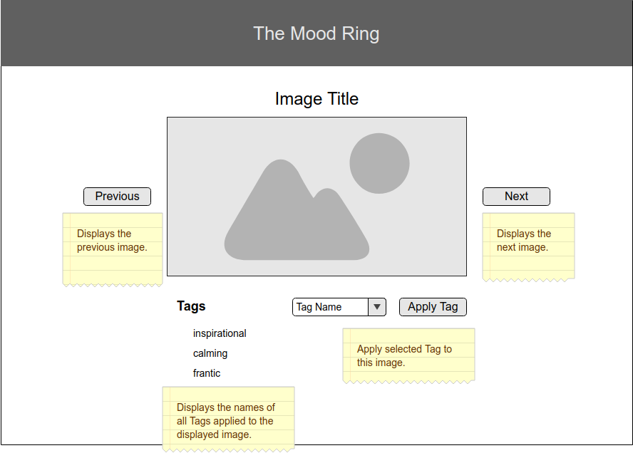

# SAGAS-MOOD-RING

This is a mindfulness application: an image carousel tagging app!  
## BUILD WITH
    This app is build with React, Redux, Redux-saga, Javascript, Nodejs, Express, AXIOS and MaterialUI.

## Install Dependencies

1. `npm install`
2. `npm run server`
3. `npm run client`

 ### Relationships
 Tags can be applied to many different images. Images can have multiple tags. This is Many-to-Many! Junction Table time!

### Carousel 

- [ ] Client-side view that displays a single image at a time, using data from database.
- [ ] Each image should have an ability to cycle through to the next/previous image. These should always work -- if you hit next on the last picture, it should go to the first image.
- [ ] With each image, users should be able to assign tags to the current image and save in the database. For base mode, duplicate tags are fine.
- [ ] Use Sagas for API requests to your server

### Main View

